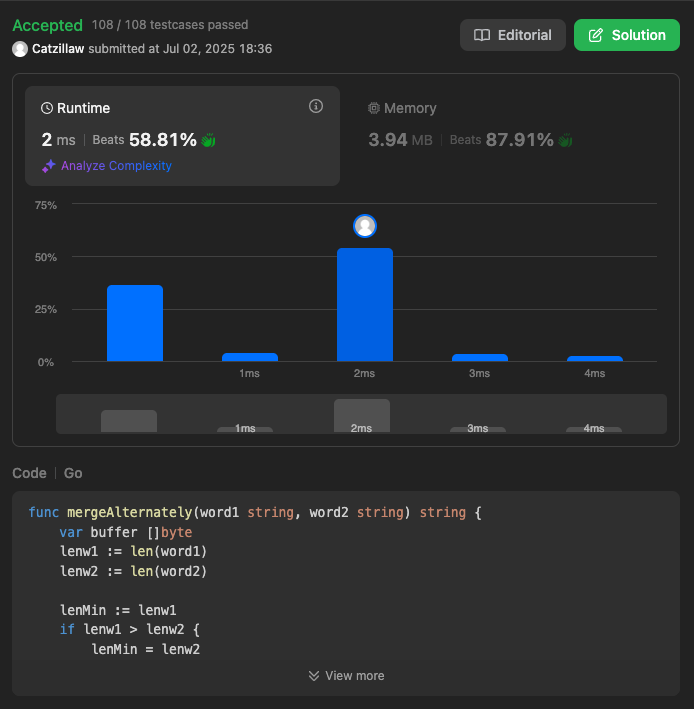
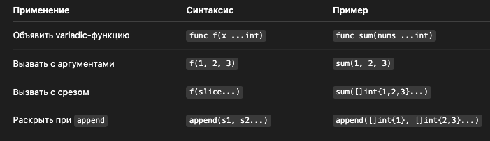

# comments

✅ А что значит ...?
Оператор ... (три точки) раскрывает срез — это называется "variadic expansion".

Пример:
```
b := []byte{'a', 'b'}
extra := []byte{'c', 'd'}
```
Без ... будет ошибка:
```
b = append(b, extra) // ❌ ошибка: mismatched types
```
🔁 Поэтому:
```
tail := []byte(word2[len1:])
buffer = append(buffer, tail...)
```
